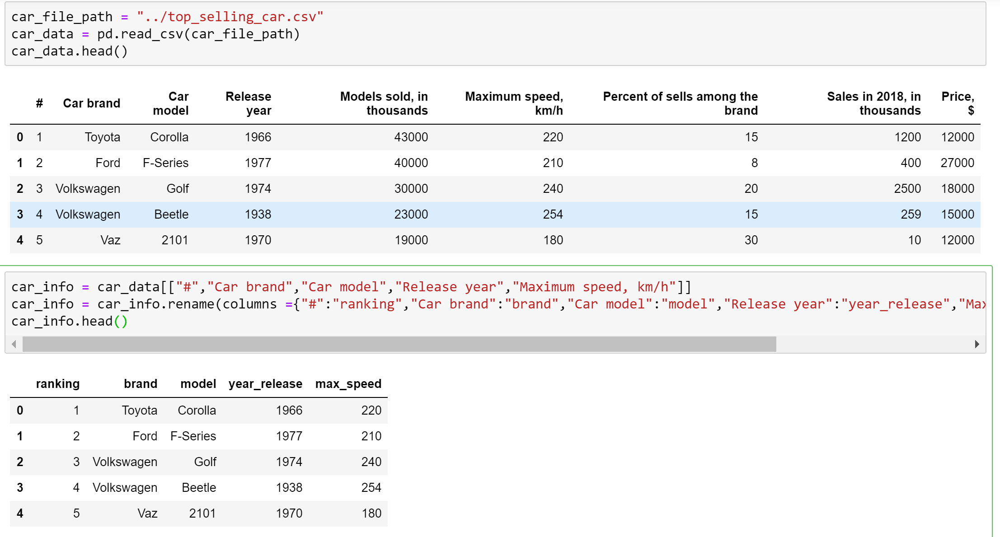
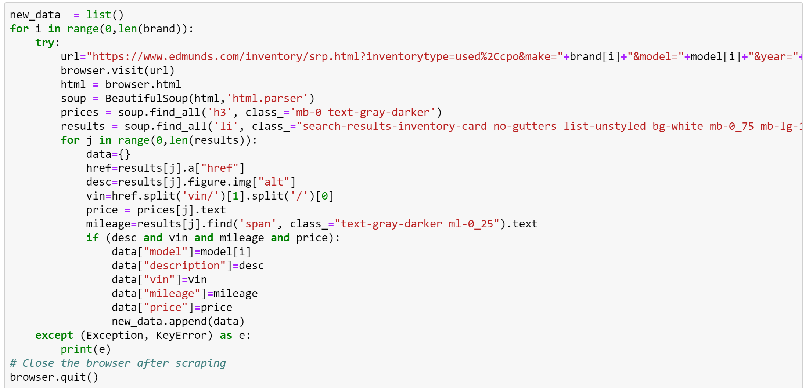
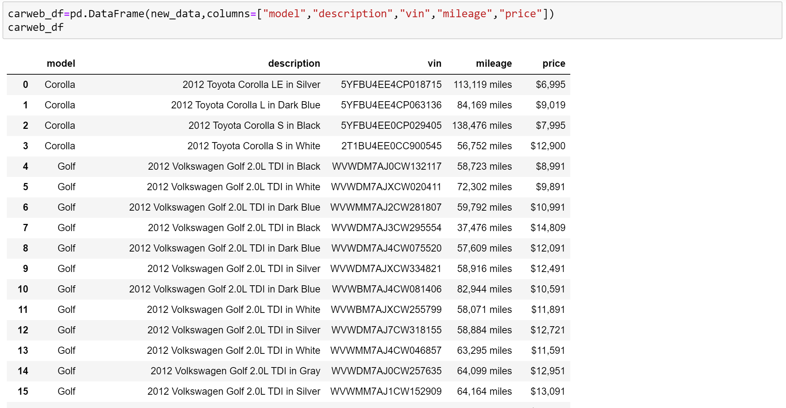
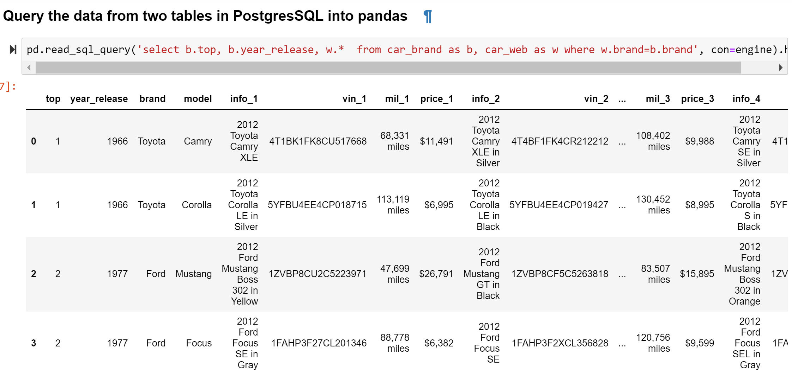

# ETL_project
1. In this project, we take a dataset from **kaggle.com** which is top_selling_car.csv created in 2018. 
We use some columns in this data named car_info table and save in SQL as one database table car_info.

2. Based on the refined dataset from top_selling_car.csv, we do web scraping on Edmunds.com website to get a list of a number of cars on first page including car's description, vin number, mileage and listed price for each model.
3. We used splinter to scrape information and used Beautifulsoup to get the data.

 

3. We saved the scraping information into a DataFrame named car_web table.

4. We save 2 databases into 2 tables named car_info and car_web in PostgreSQL.

5. From pandas, we can query information from these two tables using query synstax.

