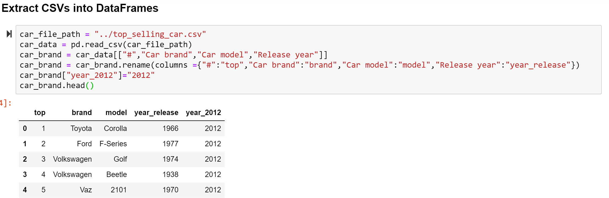
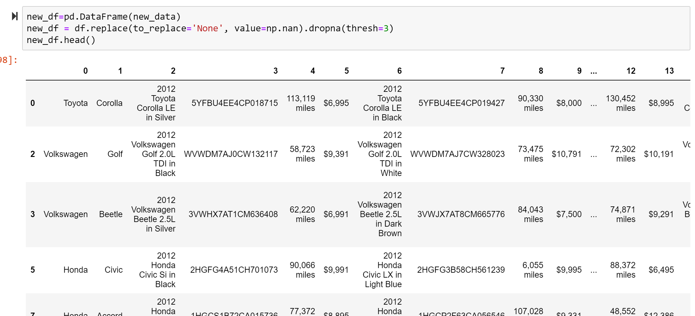

# ETL_project
1. In this project, we take a dataset from **kaggle.com** which is top_selling_car.csv created in 2018. 
We use some columns in this data and save in SQL to reference.

2. Based on the refined dataset from top_selling_car.csv, we do web scraping on Edmunds.com website to get a list of a number of cars (5 in this case) including car's description, vin number, mileage and listed price for each model.
3. We saved the scraping information into a DataFrame and delete some rows that no found information.

4. We save 2 databases into 2 tables named car_brand and car_web in PostgreSQL.
5. From pandas, we can query information from these two tables using query synstax.

