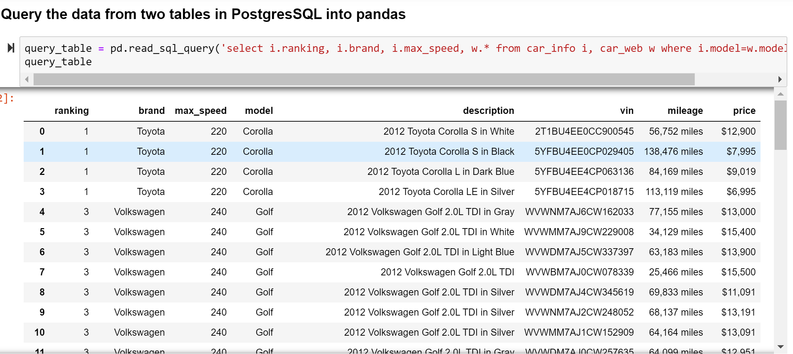

# ETL_project
1. In this project, we take a dataset from **kaggle.com** which is top_selling_car.csv created in 2018 and we take key information columns in this data named car_info table then this table will be saved in SQL as one database table car_info.

2. For next table, we do web scraping on Edmunds.com website to get a list of a number of cars on first page including car's description, vin number, mileage and listed price for each model. We use brand and model from car_info to look for lists of cars on Edmunds.

3. We use splinter with chrome driver and take Beautifulsoup to get the data.

 

3. We save the scraped information into a DataFrame named car_web table.

4. We use PostgreSQL database to store 2 tables by creating a connection to python and name these 2 tables as car_info and car_web in PostgreSQL.

5. From pandas, we can query information from these two tables using query synstax.

